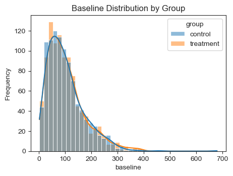

[⏮️ Back to Portfolio Home](../README.md); [⬅️ Previous Project](../house-price-prediction/index.md)

# A/B Test Simulation: Treatment Effect Evaluation

This simulation models a **controlled A/B test** to evaluate the effect of a treatment intervention on a continuous outcome metric.  
The outcome can represent performance indicators such as **revenue, engagement time, or conversions**, scaled by participants’ baseline activity levels.

---

## Notebook
[View complete analysis here](./AB_Test_Simulation_DA_24102025.ipynb)

---

## Experiment Overview

- **Control group**: baseline users without treatment  
- **Treatment group**: users exposed to the new intervention  
- **Metric**: continuous (e.g., spend, time, or count), influenced by baseline activity  
- **Goal**: estimate the treatment lift and assess statistical significance

---

## Statistical Methods

1. **Welch’s t-test**: compares mean outcomes between groups without controlling for baseline differences.  
2. **Adjusted regression model**: controls for baseline performance to isolate the true treatment effect.

---

## Results Summary

| Model | Estimate (Treatment Lift) | SE | Test Statistic | *p*-value | 95% CI | Effect Size (Cohen’s *d*) |
|:------|---------------------------:|--:|---------------:|-----------:|-------:|---------------------------:|
| Welch’s t-test | 11.17 | – | 3.46 | < 0.001 | [4.84, 17.51] | 0.155 (small) |
| Adjusted model | **10.12** | 0.45 | 22.31 | < 0.001 | – | – |

> The adjusted model more accurately captures the true lift (**~10.12 units**) by accounting for baseline variability,  
> while the t-test provides a simpler but less precise estimate.

---

### **Figures**


**Figure 1.** Baseline distribution by group (before treatment)  


**Figure 2.** Post-treatment outcome distribution by group  

---

## Interpretation

- The treatment group achieved a **significant performance increase** over control.  
- Adjusting for baseline improves accuracy and interpretability of the estimated lift.  
- The small Cohen’s *d* suggests the lift is statistically significant but modest in magnitude.

---

## Reproducibility

This simulation uses:

```python
import numpy as np
import pandas as pd
import seaborn as sns
import matplotlib.pyplot as plt
from scipy import stats
import statsmodels.formula.api as smf
```

---

**Author:** Dare Afolabi  
**License:** MIT  
**Repository:** [https://github.com/dare-afolabi/](https://github.com/dare-afolabi/)
