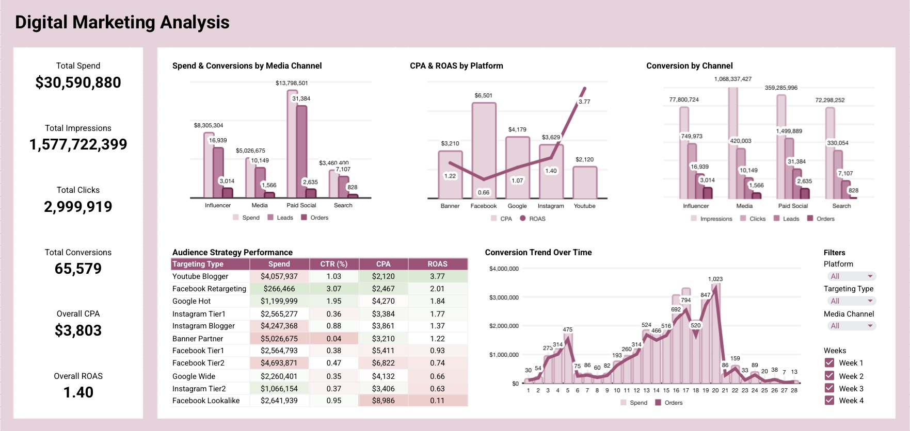
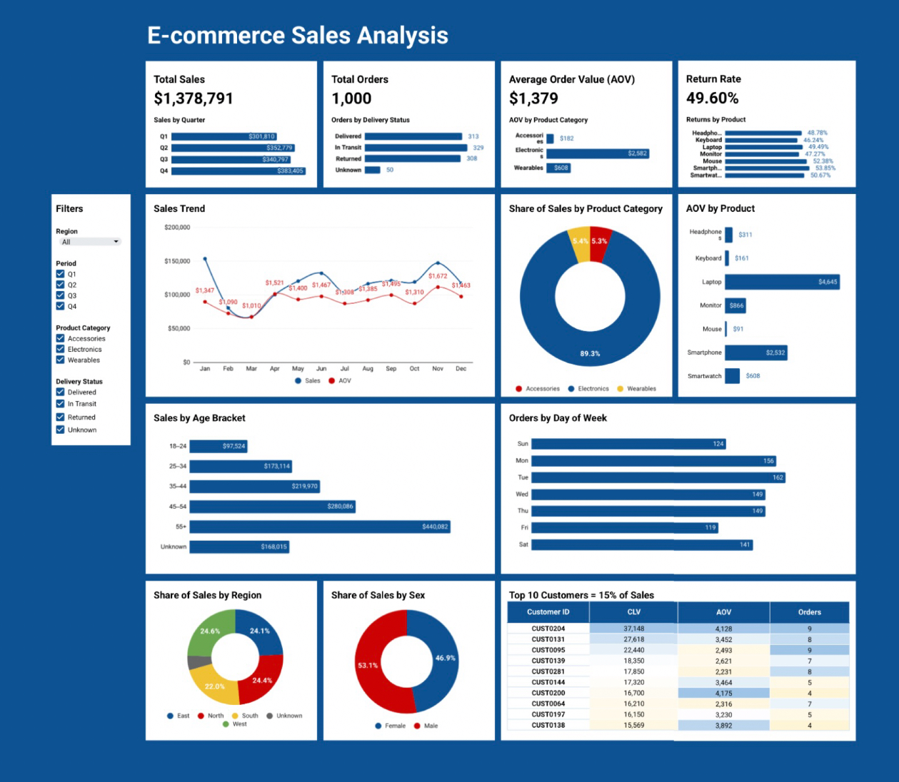
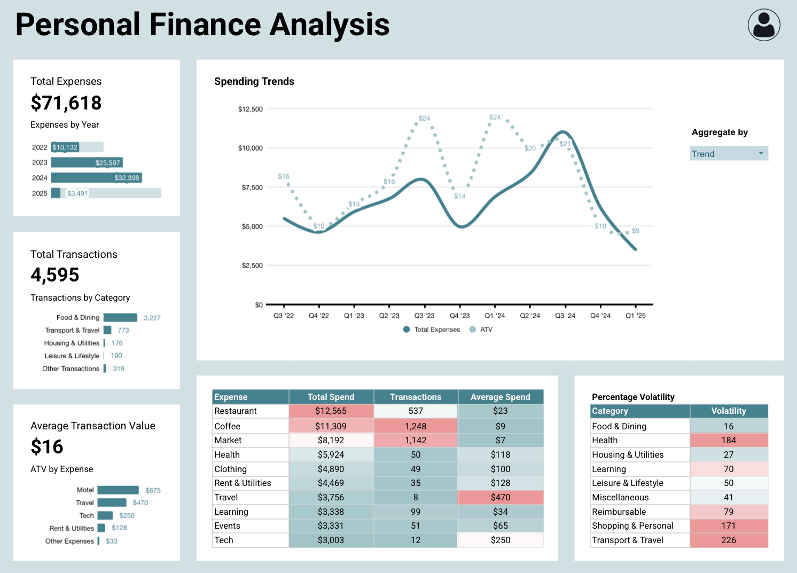

# Data Analytics Portfolio  

 Hi, I’m Dare Afolabi. Here, you’ll find projects where I’ve applied **data analysis, visualization, and business intelligence** skills to real-world datasets.

---

## Projects

### 1. [Digital Marketing Analysis](./digital-marketing-analysis)
  
-	Built with Google Sheets
	Covers campaign performance, audience segmentation, and ROI analysis
- Tracks impressions, clicks, conversions, CPA, and ROAS across channels
-	Highlights top-performing campaigns, underperforming audiences, and funnel drop-offs
- Includes interactive filters, pivot tables, and dynamic charts for deep dives

### 2. [E-commerce Sales Analysis](./ecommerce-sales-analysis)
  
- Built with **Google Sheets**  
- Covers sales trends, customer segmentation, return rates, and top customers  
- Includes **interactive filters** and pivot table-driven insights  

---

### 3. [Personal Finance Analysis](./personal-finance-analysis)

- Built with **Google Sheets** 
- Covers spending trends, volatility analysis, and transaction patterns  
- Highlights fixed vs. variable expenses and high-frequency vs. high-value categories  
- Includes an interactive filter, pivot table–driven insights, and conditional formatting

---

Stay tuned as I add more projects in areas like **customer retention, finance analytics, and marketing performance**.
