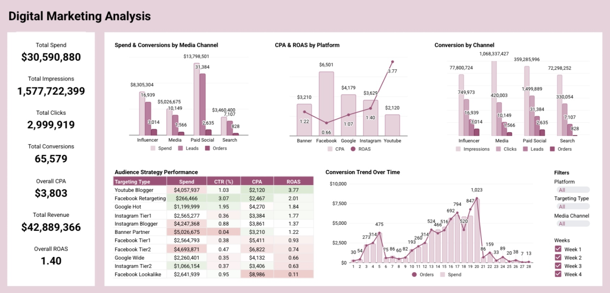

# Data Analytics Portfolio 

 Hi, I’m Dare Afolabi. Here, you’ll find projects where I’ve applied **data science, analytics, visualization, and business intelligence** skills to real-world datasets.

View on [GitHub Pages](https://dare-afolabi.github.io/data-analytics-portfolio/)

---

## Projects

### 1. [Digital Marketing Analysis](./digital-marketing-analysis)
  
-	Built with Google Sheets
	Covers campaign performance, audience segmentation, and ROI analysis
- Tracks impressions, clicks, conversions, CPA, and ROAS across channels
-	Highlights top-performing campaigns, underperforming audiences, and funnel drop-offs
- Includes interactive filters, pivot tables, and dynamic charts for deep dives

### 2. [E-commerce Sales Analysis](./ecommerce-sales-analysis)
  
- Built with **Google Sheets**  
- Covers sales trends, customer segmentation, return rates, and top customers  
- Includes **interactive filters** and pivot table-driven insights  

---

### 3. [Personal Finance Analysis](./personal-finance-analysis)

- Built with **Google Sheets** 
- Covers spending trends, volatility analysis, and transaction patterns  
- Highlights fixed vs. variable expenses and high-frequency vs. high-value categories  
- Includes an interactive filter, pivot table–driven insights, and conditional formatting  

---

### 4. [Loan Default Risk Prediction](./loan-default-risk-prediction)

Built with **Jupyter**, this notebook develops a machine learning model to predict the likelihood of loan defaults using borrower demographic, financial, and credit data. The model could potentially help financial institutions assess applicant risk, minimize credit losses, and improve lending strategies.

---

### 5. [Loan Default Risk Prediction](./loan-default-risk-prediction)

This project tackles the Kaggle “House Prices: Advanced Regression Techniques” competition by predicting house sale prices using 1,460 training samples and 80 features. Base models **RidgeCV, Random Forest, and Gradient Boosting** are assessed via cross-validation and log-RMSE, then ensembled in a **Stacking Regressor**. Feature importance scores underscore quality ratings, property size, and neighborhood prices as primary predictors of house prices.

---

Stay tuned as I add more projects in areas like **customer retention, finance analytics, and marketing performance**.

View on [GitHub Pages](https://dare-afolabi.github.io/data-analytics-portfolio/)
